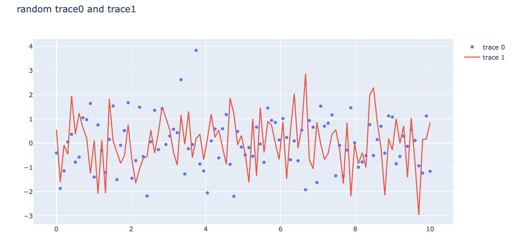
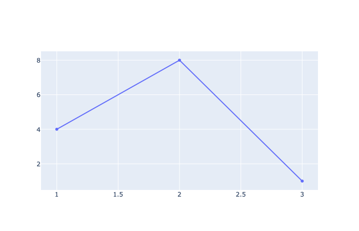
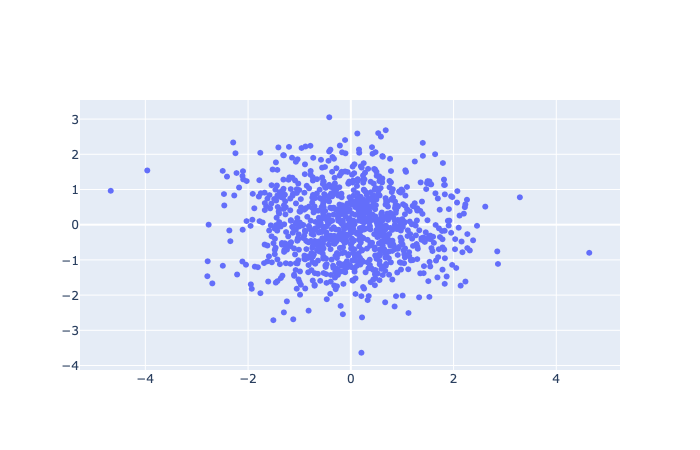
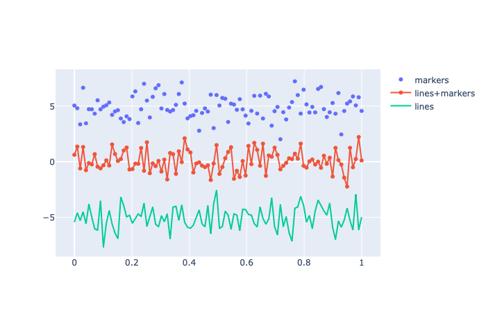

# Plotly
參考資料：<br>
[https://kknews.cc/zh-tw/code/vr2jmeq.html](https://kknews.cc/zh-tw/code/vr2jmeq.html)<br>
[https://kknews.cc/zh-tw/news/mnyeakg.html](https://kknews.cc/zh-tw/news/mnyeakg.html)<br>
[https://www.luoow.com/dc_tw/200924837](https://www.luoow.com/dc_tw/200924837)<br>
[markers](https://guides.github.com/features/mastering-markdown/)<br>
## Intro
Plotly是用來繪製互動式圖表的工具，在plotly中的圖形、元素(數據)與圖表的背景、標籤等是獨立分開的。前者使用Graph_objs定義好參數後便能將數據圖形化。但如果想要在背景圖層上有更多自定義化的內容，就需要定義Layout()。Plotly繪圖的邏輯包含：<br>
1.Trace：定義資料、座標軸及圖形等元素。<br>
2.Layout：定義背景元素：標題、邊框等。<br>
3.Data：將所有Traces存成列表，這樣便能在同一張圖表上畫多個圖形。<br>

```python
import plotly
import plotly.graph_objs as go
import numpy as np

n = 100
random_x = np.linspace(0,10,n)
random_y = np.random.randn(n)
random_y1 = np.random.randn(n)

#建構Traces
trace0 = go.Scatter(x=random_x, y=random_y, mode='markers', name='trace 0')
trace1 = go.Scatter(x=random_x, y=random_y1, mode='markers', name='trace 1')

#建構Layout
layout = go.Layout(title='random trace0 and trace1')

#將Traces儲存成Data，在圖表上便會有兩張散點圖
data = [trace0, trace1]

#繪圖
fig = go.Figure(data=data, layout=layout)  
#go.FigureWidget(data=data, layout=layout)
py.iplot(fig) 
```


#### 離線繪圖方式
  Plotly中繪製圖像有在線和離線兩種方式，在線繪圖需要註冊帳號獲取API key。而離線繪圖分成兩種`plotly.offline.plot()`和`plotly.offline.iplot()`兩種，前者會在當前工作目錄下生成一個html格式的圖，而後者為jupyter notebook中專用的方法，直接將圖嵌在ipynb文件中。<br>
（注意，在jupyter notebook中使用`plotly.offline.iplot()`時，需要在之前運行`plotly.offline.init_notebook_mode()`以完成繪圖代碼的初始化，否則會報錯）。<br>
```python
from plotly.offline import iplot

iplot([{'x':[1,2,3], 'y':[4,8,1]}],
image_height=600,
image_width=1600)             #繪製基本折線圖，尺寸為1600*600
```



## Traces
  先根據繪圖需求從graph_objs中導入相應的obj，接下來需要做的事情是基於資料，為指定的obj配置相關參數，這在plotly中稱為建造traces。<br>
二維散點圖
```python
import plotly.graph_objs as go

#創建1000筆二維正分佈數據
n = 1000
random_x = np.random.randn(n)
random_y = np.random.randn(n)

#建造Trace
trace = go.Scatter(
x = random_x,
y = random_y,
mode = 'markers')

#將Trace儲存於列表
data = [trace]

#初始化繪圖模式
plotly.offline.init_notebook_mode()

#開始繪圖
plotly.offline.iplot(data, filename='basic-scatter')
```

<br>


一張圖中可以疊加多個trace
```python
n = 100
random_x = np.linspace(0,10,n)
random_y0 = np.random.randn(n)+5
random_y1 = np.random.randn(n)
random_y2 = np.random.randn(n)-5 
#+5、-5是為了方便辨識三種圖

trace0 = go.Scatter(
x = random_x,
y = random_y0,
mode = 'markers',
name = 'markers'
)

trace1 = go.Scatter(
x = random_x,
y = random_y1,
mode = 'lines+markers',
name = 'lines+markers'
)

trace2 = go.Scatter(
x = random_x,
y = random_y2,
mode = 'lines',
name = 'lines')

data = [trace0,trace1,trace2]
plotly.offline.init_notebook_mode()
plotly.offline.iplot(data, filename='basic-scatter')
```



### Markdown

Markdown is a lightweight and easy-to-use syntax for styling your writing. It includes conventions for

```markdown
Syntax highlighted code block

# Header 1
## Header 2
### Header 3

- Bulleted
- List

1. Numbered
2. List

**Bold** and _Italic_ and `Code` text

[Link](url) and 
```

For more details see [GitHub Flavored Markdown](https://guides.github.com/features/mastering-markdown/).

### Jekyll Themes

Your Pages site will use the layout and styles from the Jekyll theme you have selected in your [repository settings](https://github.com/YuTe-Lai/ploty.github.io/settings). The name of this theme is saved in the Jekyll `_config.yml` configuration file.

### Support or Contact

Having trouble with Pages? Check out our [documentation](https://help.github.com/categories/github-pages-basics/) or [contact support](https://github.com/contact) and we’ll help you sort it out.
